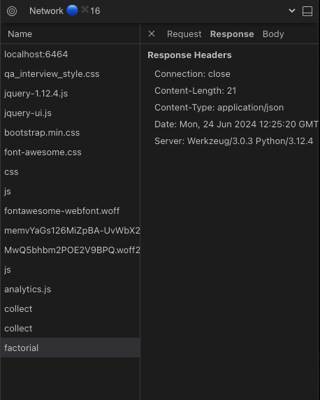

## What the application does

This simple web application. This application calculates the factorial of a number.
The factorial of a number is the product of all the integers from 1 to that number. For example, the factorial of 6 is 1*2*3*4*5*6 = 720 . Factorial is not defined for negative numbers, and the factorial of zero is one, 0!

We have exactly one page with:

* one text box 
* one submit button
* a page title 
* three hyperlinks 
* a copyright message

## Setup

1. `pip install requirements.txt`
2. To start the application, run `python qa_interview.py` 
3. Visit `localhost:6464` in your browser.

## QA Requirements for you to implement

1. Write a locator (CSS selector/XPath) for the red form validation styling
    input[style*='red']
2. Find the console message printed = "Hello! I am in the done part of the ajax call"
    = "Hello! I am in the done part of the ajax call" and "{answer: <some_answer>}"
3. Write a Selenium script to test that the factorial of 7 is 5040: See scripts under e2e/tests/factorial.ts
4. Figure out the API call being made along with the headers and parameters sent
    * Request with Header and Body information: 
    * Response with Header information: 
    * Response Body: 
5. Write a bug report

**Bug ID:** #1
**Title/Summary:** Incorrect link displayed for Terms & Conditions
**Description:** 
 - **Observed Behavior:** Clicking on the Terms & Conditions takes the user to the Privacy statement
 - **Expected Behavior:** Clicking the Terms & Conditions should take the user to the Terms & Conditions page
 - **Steps to Reproduce:** 
	 1. User navigates to http://localhost:6464/
	 1. User clicks the "Terms & Conditions" link

**Frequency:** Always
**Environment Details:** 
 - **Operating System:** MacOS Sonoma 14.5
 - **Browser/Device:** Chrome v126.0.6478.61
 - **App Version:** Version 1

**Attachments:** 
 - [Video](video.mov)

**Severity:** Minor
**Priority:** Low
**Status:** New 
**Additional Information:** 
 - **Workarounds:** Users can access the Terms & Conditions page directly by going to the path "/terms"

6. Document a test case

Following the conventional test case approach:

 **Test Case ID:** TC002 
 
 **Test Case Title:** Verify Factorial Calculation for a Positive Number 
 
 **Test Case Description:** Ensure that the application correctly calculates the factorial of a given positive integer. 
 
 **Preconditions:** 
 1. The user has access to the factorial calculation feature. 

**Test Steps:** 
	1. Open the application. 
	2. Navigate to the factorial calculation feature. 
	3. Enter a positive integer in the input field (e.g., 5). 
	4. Click on the 'Calculate' button. 

**Test Data:** 
	- **Input:** 5 

**Expected Result:** - The application should display the factorial of 5 as 120 (since 5! = 5 * 4 * 3 * 2 * 1 = 120). **Actual Result:** 120
**Status:** (Pass/Fail)
**Test Executed By:** Azariah Engelbrecht
**Date of Execution:** (Date)

Following the BDD format:

- Feature: Factorial Caculator

    - Scenario: Caculating factorial of a positive integer
        - **Given** the number 7
        - **When** calculating the factorial
        - **Then** the result should be 5040

7. Include test coverage

    - Feature: Factorial Caculator
    1. Scenario #001
        - **Given** the number 7
        - **When** calculating the factorial
        - **Then** the result should be 5040
    1. Scenario #002: Calculate the factorial of zero
        - **Given** the number 0
        - **When** calculating the factorial
        - **Then** the result should be 1
    1. Scenario #003: Handle non-integer input
        - **Given** a letter
        - **When** calculating the factorial
        - **Then** an error message should display indicating "Please enter in an integer"
    1. Scenario #004: Handle negative number input
        - **Given** a negative number
        - **When** calculating the factorial
        - **Then** an error message should display indicating "Please enter in a positive integer"
    1. Scenario #005: Display the factorial calculation page
        - **Given** the user navigates to the factorial calculation page  
        - **Then** the page title should be displayed as "Factoriall"  
        - **And** there should be one text box for entering the number  
        - **And** there should be one submit button labeled "Calculate"  
        - **And** there should be three hyperlinks  
        - **And** the page should display a copyright message  

8. Add any documentation that might be necessary to explain your process, include this in a file in the repo.

## How to submit

Please upload the code for this project to GitHub, and post a link to your repository.
